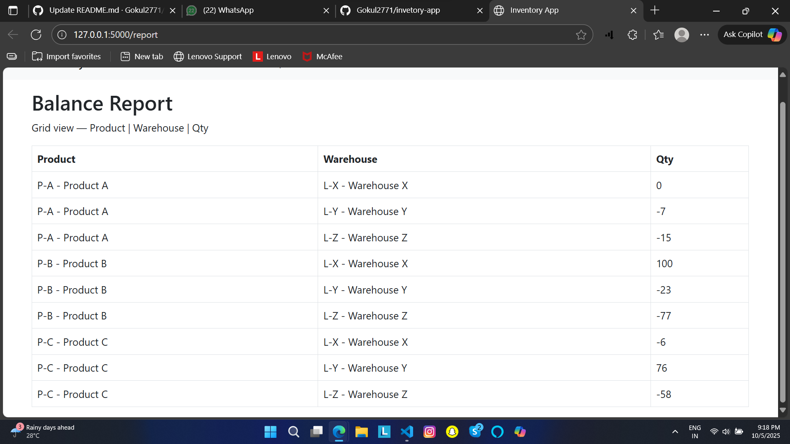
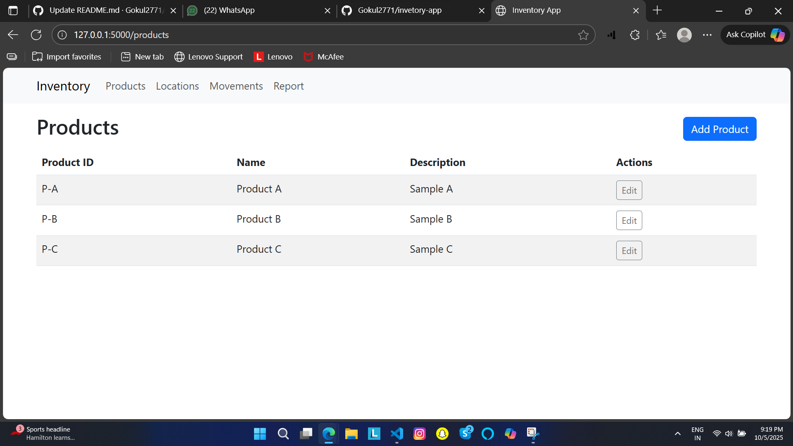
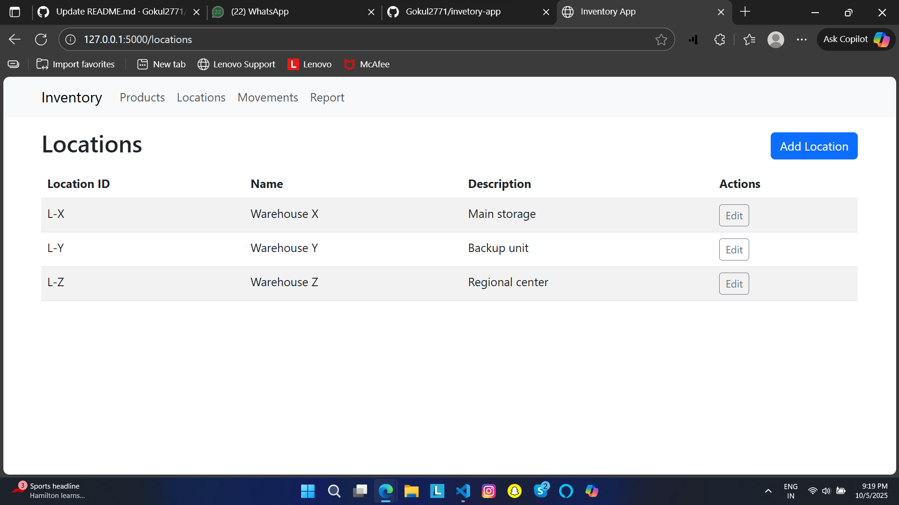
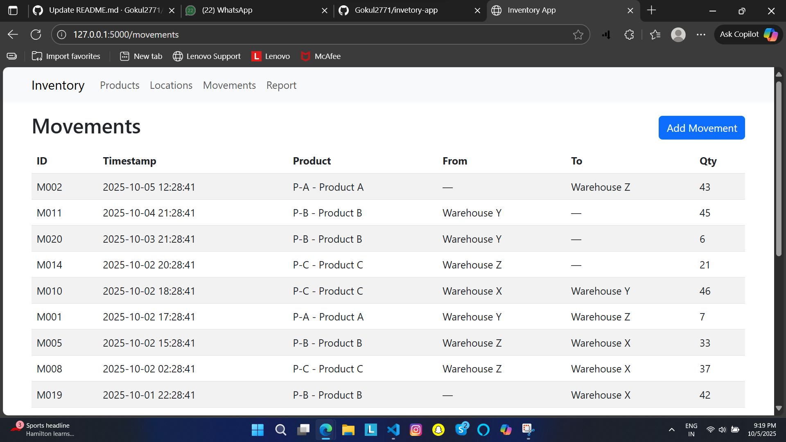
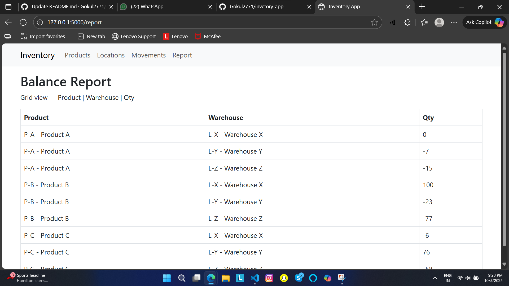

# Inventory App (Flask) — Submission

## What it is
Simple inventory management app (Products, Locations, ProductMovements) with a report showing product balance per location.

## How to run (Windows PowerShell)
```powershell
cd G:\project-on-flash\inventory-app
.\venv\Scripts\activate
pip install -r requirements.txt
python data_seed.py    # seeds sample products/locations/movements
python run.py
# open http://127.0.0.1:5000/




